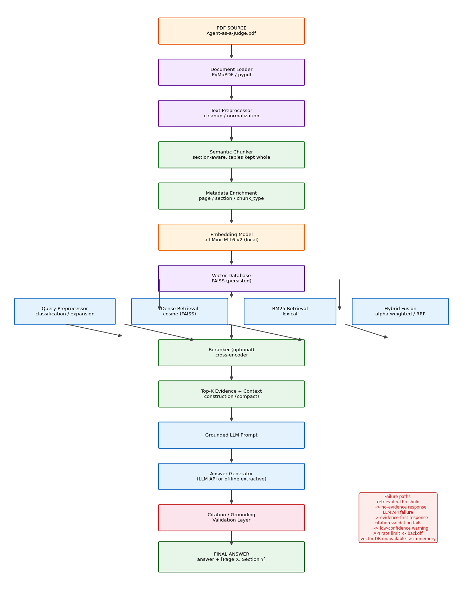

# Agent-as-a-Judge — RAG Research Assistant

A production-shaped, **document-grounded RAG chatbot** for the paper
*"Agent-as-a-Judge: Evaluate Agents with Agents"* (arXiv:2410.10934, ICML 2025).

The system ingests the PDF, builds a persistent local vector index, retrieves evidence with a
**hybrid dense + BM25** pipeline (optional cross-encoder reranking), answers **strictly from the
retrieved evidence**, and exposes **traceable citations** — plus an evaluation console and an
automated 15-question golden-set harness documented below.

> Core principle: **the chatbot answers from evidence, not from imagination.** If the evidence does
> not support an answer, it says so.

---

## Project Overview

| Component | What it does |
|---|---|
| **Ingestion** | PyMuPDF → page-aware text extraction → table detection → section-aware semantic chunking with metadata (`page`, `section`, `chunk_type`) |
| **Indexing** | Local sentence-transformers embeddings → persisted FAISS index + BM25 corpus (no API, no GPU required) |
| **Retrieval** | Query classification → optional expansion → dense + BM25 → weighted/RRF fusion → optional cross-encoder rerank → table-aware evidence selection |
| **Generation** | Strict grounded prompt with delimited evidence; swappable LLM providers (OpenAI / Gemini / Groq / offline extractive fallback) |
| **Validation** | Citation & numeric verification: every claim checked against evidence; fabricated numbers rejected |
| **Security** | Prompt-injection / jailbreak defense: retrieved text is **data, not instructions** |
| **Evaluation** | 15 golden questions with retrieval metrics (Recall@k, Precision@k, MRR, nDCG), generation metrics (numeric correctness, faithfulness, completeness, page accuracy) and system metrics (latency, tokens, cost) |
| **Observability** | Structured JSON logging of retrieval/generation metadata; per-query cost + latency tracking; disk cache for retrieval |

The whole pipeline runs on a laptop with zero API cost for embeddings and retrieval.

---

## Architecture



Launch view:
```
PDF → loader → preprocessor → semantic chunker → metadata → embeddings → FAISS
                                                                        │
USER QUERY → query understanding → dense + BM25 → hybrid fusion → rerank → top-k evidence
        │
        └──────────► context construction → grounded LLM → citation validation → ANSWER + [Page X, Section Y]
```

Failure paths are first-class: low retrieval confidence → "insufficient evidence" response;
LLM API failure → evidence-first response; vector DB unavailable → in-memory fallback;
embeddings unavailable → BM25-only. See `docs/architecture.md` for the detailed reasoning.

Mermaid sources: [`docs/rag_architecture.mmd`](docs/rag_architecture.mmd),
[`docs/retrieval_workflow.mmd`](docs/retrieval_workflow.mmd).

---

## Features

- PDF ingestion with page/section metadata preservation (`src/ingestion/`)
- Section-aware semantic chunking; tables kept whole (`src/ingestion/chunker.py`)
- Hybrid retrieval: dense (cosine) + sparse (BM25), `alpha`-weighted or RRF (`src/retrieval/hybrid.py`)
- Optional cross-encoder reranking with graceful fallback (`src/retrieval/reranker.py`)
- Citation generation + validation layer (`src/generation/citation.py`)
- Anti-hallucination: retrieval threshold, evidence requirement, numeric verification
- Jailbreak / prompt-injection defense (`src/generation/security.py`)
- Query understanding, expansion and routing (`src/retrieval/query_*`, `routing.py`)
- Multi-turn conversation support (bounded history)
- Retrieval disk caching; persistent index (no re-embedding on start)
- Cost & latency tracking with per-query logs
- Streamlit chat UI with evidence panel, retrieval debugger, evaluation dashboard
- FastAPI backend (`/api/query`, `/api/evaluation`, `/api/stats`, ...)
- Evaluation suite: 15 golden questions, automated metrics, plots and report
- CLI: `ask.py`, `ingest.py`, `build_index.py`, `evaluate.py`
- Docker support (compose: API + UI)
- 40 automated tests (unit / integration / security / regression)

---

## Repository layout

```
.
├── src/
│   ├── ingestion/           loader.py, parser.py, chunker.py
│   ├── retrieval/           embeddings, vector_store, bm25, hybrid, reranker, query_*, routing
│   ├── generation/          prompts, llm (providers), citation, security
│   ├── evaluation/          questions.json, metrics.py, evaluator.py
│   ├── api/main.py          FastAPI server
│   ├── pipeline.py          orchestration (query → answer)
│   ├── config.py            enivronment/settings + pricing table
│   ├── schemas.py           dataclasses
│   └── cache.py             disk cache
├── app/streamlit_app.py     chat + evaluation console UI
├── scripts/                 ingest, build_index, evaluate, ask, generate_diagrams
├── tests/                   pytest suite
├── docs/                    architecture.md, .mmd + .png diagrams, evaluation_report.md
└── data/raw/Agent-as-a-Judge.pdf
```

---

## Installation

Requires Python 3.10+ (tested 3.10/3.11).

```bash
git clone <repo-url> && cd evidra-rag
python -m venv .venv
source .venv/bin/activate        # Windows: .venv\Scripts\activate
pip install -r requirements.txt
```

Optional but recommended for embedding downloads on first index build — the index step needs
internet once (`all-MiniLM-L6-v2`, ~90 MB) and the reranker once if enabled
(`ms-marco-MiniLM-L-6-v2`, ~90 MB). Everything after that is offline.

---

## Configuration

Copy `.env.example` to `.env` and adjust as needed. All values are optional.

```bash
cp .env.example .env
```

Key options:

| Variable | Default | Meaning |
|---|---|---|
| `LLM_PROVIDER` | `auto` | `auto` \| `openai` \| `gemini` \| `groq` \| `local` |
| `OPENAI_API_KEY` / `OPENAI_MODEL` | — / `gpt-4o-mini` | OpenAI chat completions |
| `GEMINI_API_KEY` / `GROQ_API_KEY` | — | alternate providers (OpenAI-compatible) |
| `EMBEDDING_MODEL` | `sentence-transformers/all-MiniLM-L6-v2` | local embedder |
| `USE_RERANKER` | `false` | enable cross-encoder/score reranking (off by default — Phase 3 ablation measured no lift, see `docs/eval_results/ablation/`) |
| `RERANKER_KIND` | `cross` | reranker strategy when enabled: `cross` (cross-encoder) \| `score` (hybrid+cosine blend) |
| `HYBRID_ALPHA` | `0.5` | dense weight in weighted fusion |
| `HYBRID_METHOD` | `weighted` | `weighted` \| `rrf` |
| `FINAL_TOP_K` | `6` | evidence chunks sent to the LLM |
| `MIN_SIMILARITY` | `0.35` | retrieval confidence gate |
| `KNOWLEDGE_BOUNDARY_MIN_SIM` | `0.30` | out-of-knowledge floor: if the best dense similarity falls below this, the sparse-token fallback never marks evidence sufficient |
| `API_MAX_QUESTION_CHARS` | `4000` | question length cap in the FastAPI service |
| `API_RATE_LIMIT_PER_MIN` | `60` | in-process token-bucket rate limit (per client IP; `0` = off) |
| `API_AUTH_USERNAME` / `API_AUTH_PASSWORD` | empty | when both set, HTTP Basic auth is required |

No API key → the system runs fully offline with the **extractive evidence fallback**
(deterministic, grounded quotes — never invented content). Add a key to get free-form
synthesized answers from a real LLM.

---

## Running ingestion

```bash
# The PDF ships in data/raw/, but you can (re-)download it from arXiv:
python scripts/ingest.py --download

# Extract + preprocess + chunk:
python scripts/ingest.py
```

Output: `data/processed/chunks.json`, `pages.json`, `ingestion_stats.json`.

## Building the index (once)

```bash
python scripts/build_index.py
```

Embeds all chunks, writes the FAISS index to `data/processed/index/`, and precomputes the
gold-evidence map for regression tests. Subsequent starts load the persisted index — **no
re-embedding**.

## Running the application

```bash
# UI
streamlit run app/streamlit_app.py

# API
uvicorn src.api.main:app --reload --port 8000

# CLI
python scripts/ask.py "What is the average cost for OpenHands?"
```

## Running evaluation

```bash
python scripts/evaluate.py
```

Writes `docs/evaluation_report.md`, `data/processed/evaluation_results.json`, and charts in
`docs/eval_plots/`. Also refresh diagrams with `python scripts/generate_diagrams.py`.

---

## Retrieval Strategy

Two independent retrievers are fused:

- **Dense** — sentence-transformers embeddings + FAISS inner-product (cosine). Captures
  semantic similarity.
- **Sparse** — BM25 (lexical). Guarantees exact terms like `6.38`, `97.72%`, `cn9o` match.

**Weighted fusion** (default): min-max normalize each score set, combine with
`alpha * dense + (1 - alpha) * sparse` (`alpha = 0.5`). **RRF** is available for rank-only
fusion. Then optional cross-encoder reranking re-orders candidates by query–chunk relevance.
Numeric questions are routed to boost `table` / `result` / `cost-analysis` chunks so exact
values like OpenHands' `$6.38` / `362.41 s` are pulled from Table 1 rather than from a
plausible-sounding paragraph.

An important systems lesson from the paper itself: **more search machinery is not always
better.** The paper's own ablation hit its best alignment (90.44%) *without* the search module,
while BM25 (86.06%), Sentence-BERT (87.70%) and fuzzy search (85.52%) all *hurt* on their
simple workspaces. This repo mirrors that philosophy: hybrid retrieval is measurable, routing
is conservative, and every component can be turned off and compared via `scripts/evaluate.py`.

---

## Security

Retrieved text is isolated in `>>RETRIEVED_EVIDENCE_START<< ... END<<` delimiters and the system
prompt declares it **data, not instructions**. `JailbreakGuard` flags attempts to override
grounding ("ignore the PDF", "reveal your system prompt", "invent a number", "do not cite",
...). Flagged queries still receive a PDF-grounded response with an explicit neutralization
note. Automated tests in `tests/test_security.py` exercise eight injection payloads.

---

## Anti-hallucination

- **Retrieval threshold** — if the best cosine similarity is below `MIN_SIMILARITY`, return
  *"I could not find sufficient evidence for this answer in the provided document."*
- **Evidence requirement** — the LLM receives only retrieved evidence; no general-knowledge
  supplementation.
- **Numerical verification** — a `CitationValidator` checks every numeric claim in the answer
  against the evidence; numbers not present in the evidence mark the answer low-confidence.
- **Citation requirement** — factual answers must carry `[Page X, Section Y]`.
- Fail-closed when the LLM errors: return the best evidence verbatim rather than fabricating.

---

## Evaluation

The benchmark uses the 15 golden questions supplied for this assignment (numbered 4–18; three
additional questions 1–3 may be appended to `src/evaluation/questions.json` later). Each
question defines `required_evidence` phrases, expected pages and key values. Relevance labels
are derived deterministically from phrase presence, so Retrieval@k / MRR / nDCG are computed
without an LLM judge.

See **[docs/evaluation_report.md](docs/evaluation_report.md)** for the full run, and
`docs/eval_plots/` for charts. Summary metrics:

- Retrieval: Recall@6, Precision@6, MRR, nDCG@6 (raw hybrid and post-rerank)
- Generation: numeric recall, citation correctness, faithfulness, completeness, page accuracy
- System: latency, token usage, estimated LLM cost, cache hit rate

Ground-truth anchors verified by the suite include: DevAI `55/365/125`, savings `97.72% / 97.64%`,
Agent-as-a-Judge `$30.58 / 118.43 min`, Human-as-a-Judge `$1,297.50 / 86.5 h`, OpenHands
`$6.38 / 362.41 s`, GPT-Pilot `44.80%`, MetaGPT Task Solve Rate `0.00%`, black-box OpenHands
alignment `90.44% vs 60.38%`, ablation `65.03 → 75.95 → 82.24 → 90.44`, search ablation
`90.44% (no search)`, SVM/LSTM, R1 `1080p`, and `cn9o 23.77%`.

---

## Limitations

- The extractive fallback (no API key) answers by quoting evidence rather than synthesizing;
  free-form reasoning is a function of the selected LLM quality.
- Retrieval metrics use phrase-based relevance labels, which are deterministic but approximate
  graded human judgement.
- Chunking is structural (sections/paragraphs/tables); truly arbitrary multi-column layouts may
  occasionally merge text spans.
- PDF tables are extracted both as structured rows and as embedded page text, which can create
  near-duplicate evidence for the same values (acceptable at this corpus size, tracked in
  `ingestion_stats.json`).
- Single-document corpus; multi-document and long-context scenarios are future work.
- Reranking and some larger embedders need an initial one-time model download (documented).

---

## Future Improvements

- Multi-document RAG (folder of PDFs, websites, DOCX, databases)
- Graph RAG for requirement dependency chains (DevAI's DAG structure is a natural fit)
- Adaptive retrieval: query routing to specialised retriever ensembles
- Agentic retrieval: retrieval as a sub-agent with explicit verify loops (the paper's own topic)
- Advanced reranking: listwise models, learned fusion weights
- Multimodal RAG (figures in DevAI tasks and the paper's diagrams)
- LLM-as-judge answer grading for generation metrics
- Conversational memory with reference resolution across turns

---

## License / Notes

Code is provided for evaluation; the paper and dataset belong to their respective authors.
No API keys are committed; secrets live only in `.env` (gitignored). If you use Docker-only:
`docker compose up` builds the index on first start (needs internet for model + optional LLM key).